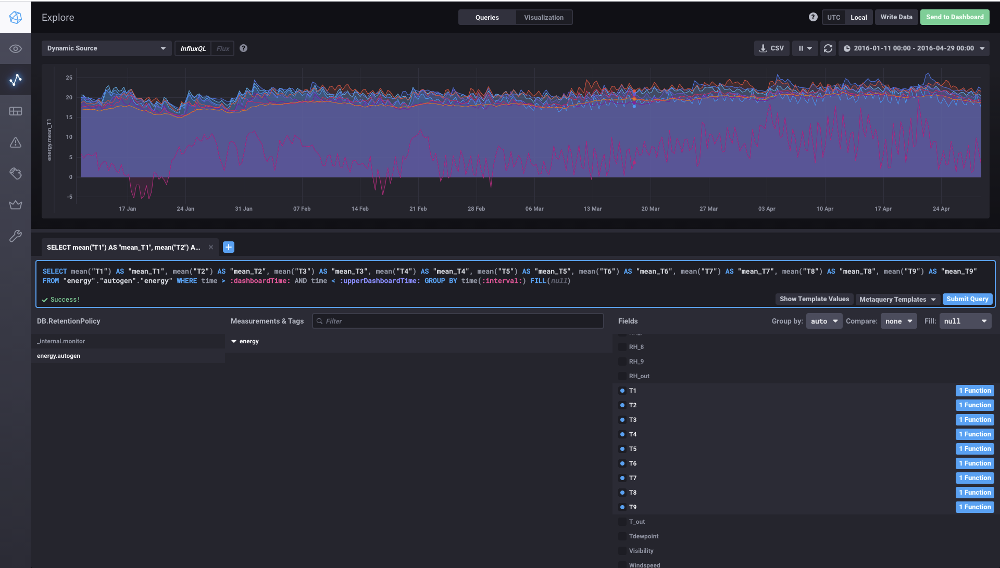

# Vanderbilt - Big Data 2021 - Homework 4 timeseries database - InfluxDB

This is the fourth homework. The deadline is March 16, 11:59 PM.

# Goals of the exercise. 

* Learn to install and configure time-series database on AWS EC2 instance;
* Learn to monitor time serial data flow using Chronograf;
* Learn to load data from CSV file to influxdb database;
* Learn to perform some basic analysis for multivariate time series.

# Checklist

+ [Step-1 Create the EC2 Instance](#step-1-create-the-ec2-instance)
+ [Step-2 Install the InfluxDB](#step-2-install-the-influxDB)
+ [Step-3 Configure the InfluxDB](#step-3-configure-the-influxDB)
+ [Step-4 Create the Energy Database](#step-4-create-the-energy-database)
+ [Step-5 Install Chronograf for Data Visualization](#step-5-install-chronograf-for-data-visualization)
+ [Step-6 Load Dataset and Queries-80 points](#step-6-load-dataset-and-queries-80-points)


# Background Material

## Prior Reading

* Read all the reading materials given by Prof. Dubey
* Complete the tutorials in week content.
* Additional links: https://docs.influxdata.com/influxdb/v1.8/introduction/get-started/
* Review information on chronograph here : https://docs.influxdata.com/chronograf/v1.8/
* You will be using plotly to make some timeseries charts in the python notebook. A sample chart has been provided in the notebook. Refer to https://plotly.com/python/basic-charts/ for the API.

## Useful Instructions -- Please watch. Most of your problems will be answered here.

* In the assignment you will create an EC2 instance and install your own influxdb server. For this you will need to see the following videos
  * [Creating and EC2 Instance](https://brightspace.vanderbilt.edu/d2l/le/content/269528/viewContent/1714850/View). Add ports 8086 and 8888 in the inbound rules of the security group, rather than 27017.
  * [Installing InfluxDB on the EC2 Instance PDF](https://brightspace.vanderbilt.edu/d2l/le/content/269528/viewContent/1714861/View)
  * It is very important to take authentication seriously. Change the password that provide you admin access and set it to your own.
  * [Installing InfluxDB on EC2 Instance Video](https://brightspace.vanderbilt.edu/d2l/le/content/269528/viewContent/1714860/View)

## We have also created some youtube videos that may help you in addition to the links above if you get stuck

* https://www.youtube.com/watch?v=bxQXbfgoJxo

## Remember to update the Colab badge links of all notebooks

* You did this in previous assignments - see [AcceptingaGithubassignment.pdf](AcceptingaGithubassignment.pdf)


## AWS

To access AWS go to https://aws.amazon.com/education/awseducate/ and use the account you created when you were invited to the class. Ensure that you can access this account and can land into an AWS console as shown below.

## Github

```
git clone https://github.com/vu-topics-in-big-data-2021/homework-4-<GITHUB USERNAME>.git 
```

To push code to your repo use the git commit and push commands. But first set some settings:

	git config --global user.name "Your Name"
	git config --global user.email you@example.com

Once you modify files, use git's add, commit and push commands to push files to your repo. 

	git add file.txt
	git commit -a -m 'commit message'
	git push origin master

If you would like to use SSH keys on Github, follow the instructions at:

	https://help.github.com/articles/generating-a-new-ssh-key-and-adding-it-to-the-ssh-agent/0

I may push updates to this homework assignment in the future. To setup an upstream repo, do the following:

```
git remote add upstream https://github.com/vu-topics-in-big-data-2021/homework-4.git
```

To pull updates do the following: git fetch upstream git merge upstream/master
	
This will create a new branch: upstream/main
```
git fetch upstream
```
Then merge your current brach(origin/main) with upstream/main
```	
git merge upstream/main --allow-unrelated-histories
```

You will need to resolve conflicts if they occur. If the conflicts are in notebooks. Open them in visual code and manually move the changes.

# Assignment

## Dataset Description

We'll use an [appliances energy prediction dataset](https://vanderbilt365.sharepoint.com/sites/TopicsInBigData/Shared%20Documents/General/Datasets/Nashville%20Tweets%20Dataset/nashville-tweets-2019-02-03). Please read the dataset description [here](https://archive.ics.uci.edu/ml/datasets/Appliances+energy+prediction#). 
 
## Step-1 Create the EC2 Instance

First install the EC2 instance through AWS console (use AWS free educate account login). Please choose ubuntu 20.04 as machine image, and t2.micro as instance type. Note open the security group to allow incoming connections from anywhere on ports **8086**(influxdb) and **8888**(chronograf). You did this in previous assignment for MYSQL and MongoDB. It will work similarly here. Please watch this [video](https://vanderbilt365.sharepoint.com/sites/TopicsInBigData/Shared%20Documents/General/Instructions/about%20aws%20compute%20instances/Launch%20an%20Amazon%20EC2%20Instance.mp4) for step-by-step instructions.

Caution: After doing your assignment make sure to shut down the EC2 instance and logout. This is necessary to avoid unnecessary charging to your AWS account.
Follow the instructions carefully to remain within **free tier**. That last part is very important.


## Step-2 Install the InfluxDB

Import the public key used for accessing package management system

	sudo curl -sL https://repos.influxdata.com/influxdb.key | sudo apt-key add -


Create a list file for influxdb
	
	sudo echo "deb https://repos.influxdata.com/ubuntu bionic stable" | sudo tee /etc/apt/sources.list.d/influxdb.list
	sudo apt-get update
	sudo apt install -y influxdb

Start and enable the service to start on boot up:
	
	sudo systemctl enable --now influxdb

Verify the influxdb service
	
	sudo systemctl status influxdb
	
## Step-3 Configure the influxDB

Edit the /etc/influxdb/influxdb.conf using the any editor, nano is shown below
	
	sudo nano /etc/influxdb/influxdb.conf
	
Modify the http section in influxdb.conf file

```YAML
[http]
  # Determines whether HTTP endpoint is enabled.
  enabled = true

  # Determines whether the Flux query endpoint is enabled.
  # flux-enabled = false

  # Determines whether the Flux query logging is enabled.
  # flux-log-enabled = false

  # The bind address used by the HTTP service.
  bind-address = ":8086"

  # Determines whether user authentication is enabled over HTTP/HTTPS.
  auth-enabled = true
```

Open the port 8086 in AWS EC2 instance VPC security inbound rules for remote access: https://docs.aws.amazon.com/vpc/latest/userguide/VPC_SecurityGroups.html
	
Restart the influxdb 
	
	sudo systemctl restart influxdb
	
Type the following command to create user and passwd

	curl -XPOST "http://localhost:8086/query" --data-urlencode "q=CREATE USER admin WITH PASSWORD 'type_password_here' WITH ALL PRIVILEGES"

Replace:

- username with your own username
- strong password with your own password (note that the password requires single quotes)

**Note** - Take security of your database seriously and create a strong password 

## Step-4 Create the Energy Database

Type influx at the shell (after connecting to EC2 instance over ssh) to enter the influx db shell

	influx -username 'admin' -password 'your_password_here'
	
Create an energy database at influxdb prompt

	> create database energy
	
Select the database energy to use in influxdb

	> use energy

## Step-5  Install Chronograf for Data Visualization

Download and install Chronograf on your ec2 instance:

	wget https://dl.influxdata.com/chronograf/releases/chronograf_1.8.9.1_amd64.deb --no-check-certificate
	sudo dpkg -i chronograf_1.8.9.1_amd64.deb

Connect to the influxDB and view the data on a browser. Point to the ip address of the ec2 instance and the port used for chronograph 8888. Refer to [this post on influx site](https://docs.influxdata.com/chronograf/v1.8/introduction/installation/#connect-chronograf-to-your-influxdb-instance-or-influxdb-enterprise-cluster) 

For example, the below shows the curves from T1 to T9.




## Step-6 Load Dataset and Queries-80 points

The database will be populated as part of the homework notebook load function. Then, please implement a function per query in a file called [hw4.ipynb](hw4.ipynb). Record the answers there and save it back to your repository. For some queries, you need to plot query results. You can use any python library, such as matplotlib or plotly, to plot required figures. We show an example of plotting time-series data using plotly in the [hw4.ipynb](hw4.ipynb) notebook.

## Grading Rubrics
* **10** points for loading data from CSV to InfluxDB;
* **60** points for all queries;
* **10** points for comments,explanation and clarity.
